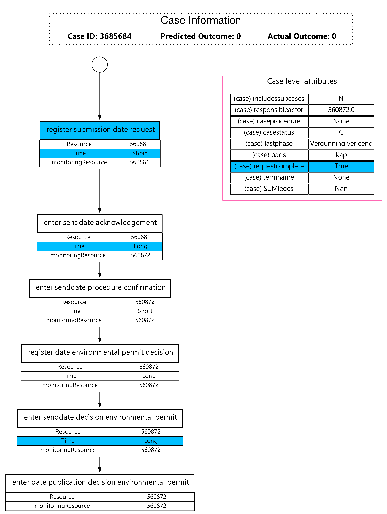

# Association rule mining visualization

Master thesis material of Suhwan Lee, UNIST Industrial Engineering
## Description
Code to visualize predicted case with satisfied association rules by coloring attributes.

Rendered images are saved in img directory.

## Content

  

### Image explanation

Case visualization image consists of **1) case information**, **2) trace** with event level attributes and
**3) case level attributes**.

Case information section represents case id, predicted outcome, and actual outcome of the case.
Predicted outcome is deriven from [rule-based predictive monitoring model](https://github.com/ghksdl6025/rule-based-predictive-monitoring).
  
Trace section which starts with starting node (circle shape) depicts activity and event level attributes by event order.
From top to bottom nodes first row of the node is event activity and rest of the rows are attributes related with the event.
The left column of node table is event level attribute name and the right column is the value of the attribute. For example, first 
event has 3 event level attributes, Resource, Time, and monitoringResource and values are 560881, Short, and 560881 respectively.
  
The last section of the image is about case level attributes, i.e., attributes regarding case information itself. Like in representing 
event level attributes, first column describes the name of the case attribute and the other column shows according value of it.

### Visualize satisfied rules

After getting association rules for predictive monitoring and classification process, there are rules which comply with information about given case.
Within the satisfied rules, case and event level attributes in accordance with association rules are colored in blue. Inspectors could anticipate 
model explainability through scanning colored entity in the image.

## Project code structure

This visualization method relies on python3, graphviz, pygraphviz, pydot, pandas packages.
'draw_graph.py' in utils contains function to render sourcode extention with .dot to png or pdf files.
load_test2.py has two function, plot_trace and trace_coloring which are plotting case and event level attributes from given case and
color attribute entity according to satisfactio rule respectively. 

